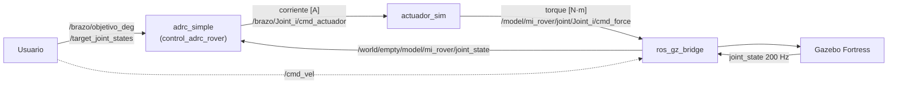

# ros2_ws_tesis

Workspace de ROS 2 de la tesis de maestría en Mecatrónica sobre el control de un rover móvil con brazo robótico de cinco grados de libertad. Contiene la descripción física del robot, su simulación en Gazebo y el controlador de posición del brazo basado en ADRC (*Active Disturbance Rejection Control*), diseñado para ejecutarse sin cambios de código tanto en simulación como en el robot real sobre una NVIDIA Jetson.

**Autor:** Ing. Adán Medina Covarrubias

| Plataforma | Versión |
|------------|---------|
| Sistema operativo | Ubuntu 22.04 (nativo, WSL o Jetson) |
| ROS 2 | Humble |
| Simulador | Gazebo Fortress (`ignition-gazebo6`) |
| Modelo dinámico | Pinocchio |

---

## Contenido

1. [Paquetes del workspace](#1-paquetes-del-workspace)
2. [Descripción del robot](#2-descripción-del-robot)
3. [Arquitectura del sistema](#3-arquitectura-del-sistema)
4. [Estructura del repositorio](#4-estructura-del-repositorio)
5. [Instalación](#5-instalación)
6. [Inicio rápido en simulación](#6-inicio-rápido-en-simulación)
7. [Otras formas de uso](#7-otras-formas-de-uso)
8. [Robot real](#8-robot-real)
9. [Documentación detallada](#9-documentación-detallada)
10. [Pendientes conocidos](#10-pendientes-conocidos)

---

## 1. Paquetes del workspace

| Paquete | Tipo | Estado | Función |
|---------|------|--------|---------|
| [`mi_rover_description`](src/mi_rover_description) | `ament_cmake` | Activo | URDF/xacro del rover y del brazo, mallas, configuración de Gazebo y RViz, y un plugin de Gazebo que fija la postura inicial del brazo. |
| [`control_adrc_rover`](src/control_adrc_rover) | `ament_python` | **Principal** | Controlador ADRC del brazo con modelo dinámico completo (Pinocchio), trayectorias quínticas, mando en corriente y modelo de actuadores para simulación. Configurable por completo desde YAML. |
| [`control_adrc_rover_cpp`](src/control_adrc_rover_cpp) | `ament_cmake` | Anterior | Primera implementación en C++ del ADRC, con matriz de masas analítica y mando directo en torque. Se conserva como referencia. |

Además, [`test/rover_commander.py`](test/rover_commander.py) es un panel de terminal que envía posturas predefinidas al brazo.

> **Importante:** `control_adrc_rover` y `control_adrc_rover_cpp` controlan las mismas articulaciones. Nunca deben ejecutarse al mismo tiempo.

---

## 2. Descripción del robot

### Rover

- Chasis con cuatro ruedas y tracción diferencial (plugin `DiffDrive` de Gazebo): separación entre ruedas de 0.63 m y radio de 0.15 m. Recibe velocidades en `/cmd_vel`.
- IMU montada en el chasis que publica en `/imu_data` a 50 Hz.
- Coeficiente de fricción de las ruedas μ = 1.5.

### Brazo

El brazo se monta sobre el chasis mediante una unión fija (`chasis_a_brazo_joint`).

| Articulación | Función | Actuador | Tipo (URDF) | Par máx. [N·m] | Vel. máx. [rad/s] |
|:------------:|---------|----------|-------------|:--------------:|:-----------------:|
| J1 | Base giratoria | Yellow Jacket + tornillo sin fin | `continuous` | 33.6 | 1.23 |
| J2 | Hombro | Maxon EC 60 flat + GSW 62 A (100:1) | `continuous` | 37.0 | 3.67 |
| J3 | Codo | Maxon EC 60 flat + GSW 62 A (100:1) | `revolute` (±π) | 37.0 | 3.67 |
| J4 | Muñeca | Yellow Jacket + tornillo sin fin | `revolute` (±π) | 33.6 | 1.23 |
| J5 | Actuador final | Servomotor de rotación continua | `continuous` | 6.0 | 6.28 |

### Configuración de Gazebo

Definida en `rover_completo.urdf.xacro`:

- `JointStatePublisher` publica la posición de J1–J5 a **200 Hz**, la misma frecuencia del lazo de control. A frecuencias menores el retardo de la medición desestabiliza el observador.
- Un `ApplyJointForce` por articulación permite el mando en torque puro.
- El plugin propio `mi_rover_initial_pose` impone una sola vez la postura inicial (J1 = π, J2 = −π/2, J3 = J4 = 0 rad) sin aplicar fuerzas ni cerrar ningún lazo.

---

## 3. Arquitectura del sistema



En el robot real, la posición la publican los encoders o los drivers, `actuador_sim` no se ejecuta y la corriente se envía directamente a los drivers de los motores. El nodo de control es el mismo; solo cambia el archivo de parámetros.

---

## 4. Estructura del repositorio

```text
ros2_ws_tesis/
├── src/
│   ├── mi_rover_description/
│   │   ├── launch/
│   │   │   ├── gazebo.launch.py          Gazebo con el rover completo
│   │   │   └── display.launch.py         RViz con sliders de articulaciones
│   │   ├── meshes/                       Mallas de Brazo, Chasis y Wheel
│   │   ├── rviz/config.rviz              Configuración guardada de RViz
│   │   ├── src/initial_joint_positions.cpp   Plugin de postura inicial
│   │   └── urdf/
│   │       ├── rover_completo.urdf.xacro Modelo maestro con plugins de Gazebo
│   │       ├── brazo.urdf                Brazo (también lo usa el controlador)
│   │       ├── chasis.urdf, rover.urdf
│   │       └── wheel.urdf, wheel.xacro   Macro de rueda
│   │
│   ├── control_adrc_rover/
│   │   ├── config/
│   │   │   ├── brazo_adrc.yaml           Parámetros de simulación
│   │   │   └── brazo_real.yaml           Parámetros del robot real
│   │   ├── launch/brazo_sim.launch.py
│   │   ├── control_adrc_rover/
│   │   │   ├── adrc_simple_node.py       Nodo de control
│   │   │   ├── actuador_sim_node.py      Modelo de actuadores (solo simulación)
│   │   │   ├── modelo_dinamico.py        M(q) y g(q) con Pinocchio
│   │   │   └── trayectoria.py            Trayectorias quínticas
│   │   └── README.md                     Documentación completa del controlador
│   │
│   └── control_adrc_rover_cpp/
│       └── src/rover_arm_full_adrc.cpp   Implementación anterior en C++
│
└── test/
    └── rover_commander.py                Panel de posturas predefinidas
```

---

## 5. Instalación

El repositorio es el propio workspace, por lo que se clona directamente como `~/ros2_ws`.

```bash
git clone https://github.com/adnavias/ros2_ws_tesis.git ~/ros2_ws
cd ~/ros2_ws
```

Instalar las dependencias del sistema:

```bash
sudo apt update
sudo apt install ros-humble-pinocchio ros-humble-ros-gz ros-humble-xacro \
                 ros-humble-joint-state-publisher-gui
```

Como alternativa, `rosdep` resuelve las dependencias declaradas en los `package.xml`:

```bash
sudo rosdep init   # solo si nunca se ha inicializado
rosdep update
rosdep install --from-paths src --ignore-src -y
```

Compilar, siempre desde la raíz del workspace:

```bash
source /opt/ros/humble/setup.bash
colcon build --symlink-install
source install/setup.bash
```

Con `--symlink-install`, los cambios en archivos YAML y Python surten efecto con solo relanzar. Solo es necesario recompilar al agregar archivos, modificar `setup.py`, `package.xml` o `CMakeLists.txt`, o editar código C++.

Para no repetir los `source` en cada terminal, pueden agregarse al final de `~/.bashrc`.

---

## 6. Inicio rápido en simulación

**Terminal 1 — Gazebo**

```bash
ros2 launch mi_rover_description gazebo.launch.py
```

**Terminal 2 — Puente Gazebo ↔ ROS 2**

`gazebo.launch.py` no inicia el puente, por lo que debe lanzarse por separado:

```bash
ros2 run ros_gz_bridge parameter_bridge \
  "/world/empty/model/mi_rover/joint_state@sensor_msgs/msg/JointState[ignition.msgs.Model" \
  "/model/mi_rover/joint/Joint_1/cmd_force@std_msgs/msg/Float64]ignition.msgs.Double" \
  "/model/mi_rover/joint/Joint_2/cmd_force@std_msgs/msg/Float64]ignition.msgs.Double" \
  "/model/mi_rover/joint/Joint_3/cmd_force@std_msgs/msg/Float64]ignition.msgs.Double" \
  "/model/mi_rover/joint/Joint_4/cmd_force@std_msgs/msg/Float64]ignition.msgs.Double" \
  "/model/mi_rover/joint/Joint_5/cmd_force@std_msgs/msg/Float64]ignition.msgs.Double" \
  "/cmd_vel@geometry_msgs/msg/Twist]ignition.msgs.Twist" \
  "/imu_data@sensor_msgs/msg/Imu[ignition.msgs.IMU"
```

Las dos últimas líneas solo son necesarias para mover el rover o leer la IMU desde ROS 2.

**Terminal 3 — Controlador del brazo**

```bash
ros2 launch control_adrc_rover brazo_sim.launch.py
```

El controlador está listo cuando aparece el mensaje `Cero fijado en la postura actual: [...] rad`.

**Terminal 4 — Objetivo**

```bash
ros2 topic pub --once /brazo/objetivo_deg std_msgs/msg/Float64MultiArray \
  "{data: [90.0, 30.0, -45.0, 0.0, 0.0]}"
```

Los ángulos se expresan en grados y son relativos a la postura que tenía el brazo al arrancar el controlador. Un sexto valor opcional fija el porcentaje de velocidad. El uso completo se describe en la [documentación del controlador](src/control_adrc_rover/README.md#7-envío-de-objetivos-al-brazo).

---

## 7. Otras formas de uso

### Visualización en RViz

Muestra el modelo con controles deslizantes por articulación, sin simulación física:

```bash
ros2 launch mi_rover_description display.launch.py
```

### Movimiento del rover

Con el puente de `/cmd_vel` activo:

```bash
ros2 topic pub --once /cmd_vel geometry_msgs/msg/Twist \
  "{linear: {x: 0.3}, angular: {z: 0.0}}"
```

### Panel de posturas predefinidas

```bash
python3 test/rover_commander.py
```

Publica en `/target_joint_states` (radianes) las posturas `h`, `00`, `0`, `1`, `2` y `3`, seleccionadas desde el teclado. Es compatible con ambos controladores. Con `control_adrc_rover` las posturas se interpretan relativas a la postura de arranque y se ejecutan con la velocidad por defecto.

### Controlador anterior en C++

```bash
ros2 run control_adrc_rover_cpp rover_arm_full_adrc
```

Se suscribe a `/target_joint_states` y publica torque directamente en `/model/mi_rover/joint/Joint_i/cmd_force`, por lo que no requiere `actuador_sim`. A diferencia del controlador principal:

- emplea una matriz de masas analítica con parámetros fijos en el código,
- usa trayectorias quínticas de duración fija (3 s),
- satura en torque y no en corriente,
- publica continuamente velocidad cero en `/cmd_vel`, lo que impide mover el rover mientras está en ejecución.

---

## 8. Robot real

El paso a la Jetson solo requiere editar `src/control_adrc_rover/config/brazo_real.yaml`, en las líneas marcadas con `# <-- AJUSTAR` (tópicos, nombres de articulaciones, QoS y sentido de giro), y lanzar:

```bash
ros2 launch control_adrc_rover brazo_sim.launch.py sim:=false
```

El procedimiento completo y las reglas de seguridad para las primeras pruebas están en la [sección 11](src/control_adrc_rover/README.md#11-despliegue-en-el-robot-real-jetson) y la [sección 14](src/control_adrc_rover/README.md#14-reglas-de-seguridad) de la documentación del controlador. **Ninguna configuración debe probarse en el robot sin haberse validado antes en simulación.**

---

## 9. Documentación detallada

[`src/control_adrc_rover/README.md`](src/control_adrc_rover/README.md) documenta el controlador principal:

- interfaz ROS completa: tópicos, tipos y unidades,
- funcionamiento interno de cada nodo,
- referencia de todos los parámetros YAML,
- monitoreo, diagnóstico y solución de problemas,
- reglas de seguridad y parámetros físicos pendientes de verificar,
- glosario.

---

## 10. Pendientes conocidos

- Los `package.xml` de los tres paquetes mantienen la licencia como `TODO`, y los de `mi_rover_description` y `control_adrc_rover_cpp`, también la descripción.
- `setup.py` de `control_adrc_rover` registra el ejecutable `adrc_node`, cuyo módulo ya no forma parte del repositorio. La compilación no se ve afectada, pero `ros2 run control_adrc_rover adrc_node` falla.
- Algunos parámetros de los actuadores son supuestos y deben verificarse con datos medidos (relación del tornillo sin fin, inercia del rotor Yellow Jacket, corriente segura). Ver la [sección 15](src/control_adrc_rover/README.md#15-parámetros-supuestos-pendientes-de-verificar) de la documentación del controlador.
